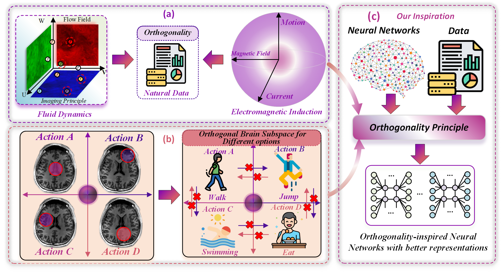
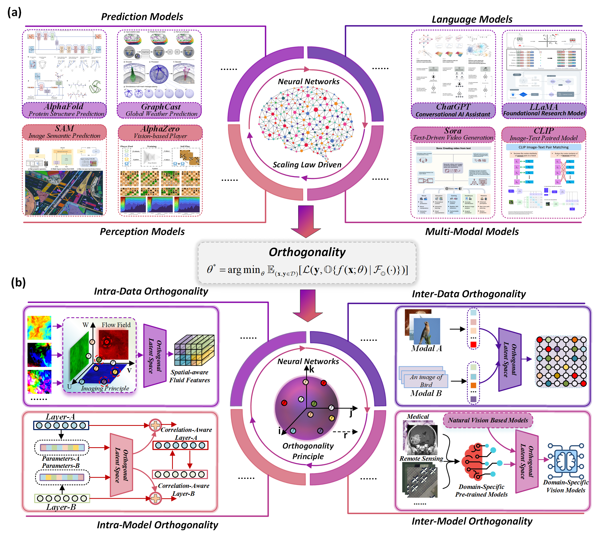

# ODDM

Motivated pervasive role of orthogonality in natural data and models, we propose orthogonality as a cornerstone for principled neural network development:

(a) Orthogonality in natural data like fluid dynamics and electromagnetic induction. (b) Our brain utilizes orthogonal subspace to decide different options with better effectiveness. (c) The orthogonality in nature inspired us to incorporate it into neural networks as a foundational principle across data and models.

\\bigsapce
We thoroughly evaluate the effectiveness of orthogonality under intra-data, inter-data, intra-model, and inter-model settings:

The main concept of the proposed orthogonality principle. (a) Existing scaling-law-driven neural networks like large foundational models and multimodal models have demonstrated exceptional capabilities across a wide range of applications. (b) Orthogonality could serve as a foundational principle across data and models.

## Orthogonality for Deep Learning across Data and Models including:
### Intra-Data Orthogonality
To directly investigate the effect of intra-data orthogonality, we applied the orthogonality principle to neural networks tasked with super-resolution analysis of fluid dynamics, where intrinsic orthogonality exists among spatial velocity components.

### Inter-Data Orthogonality
In the inter-data orthogonality context, we explored the efficacy of orthogonality by employing the CLIP model as the baseline architecture. By modeling orthogonal relationships between different modalities of CLIP, the recognition performance can obtain obvious improvements.

### Intra-Model Orthogonality
By incorporating orthogonality within the architecture of the neural network, we evaluate the effectiveness of orthogonality for parameter-efficient fine-tuning of the SAM model. The integration of the orthogonality principle facilitates the modeling of relationships among parameters from different layers in an orthogonal manner, thereby validating its effectiveness in intra-model orthogonality scenarios.

### Inter-Model Orthogonality
To further validate the effectiveness of the orthogonality principle in the context of inter-model orthogonality, we examine the transferability of the natural-vision-based CLIP model across diverse domains, focusing on remote sensing and medical imaging with domain-specific models. By establishing inter-model orthogonal relationships between these distinct domains, we observe significant performance improvements, demonstrating the utility of orthogonality in enhancing cross-domain adaptability and efficacy.

#### The experimental codes are available in the corresponding file folders.

#### The experimental datasets are publicly available as detailed in the corresponding manuscript.

